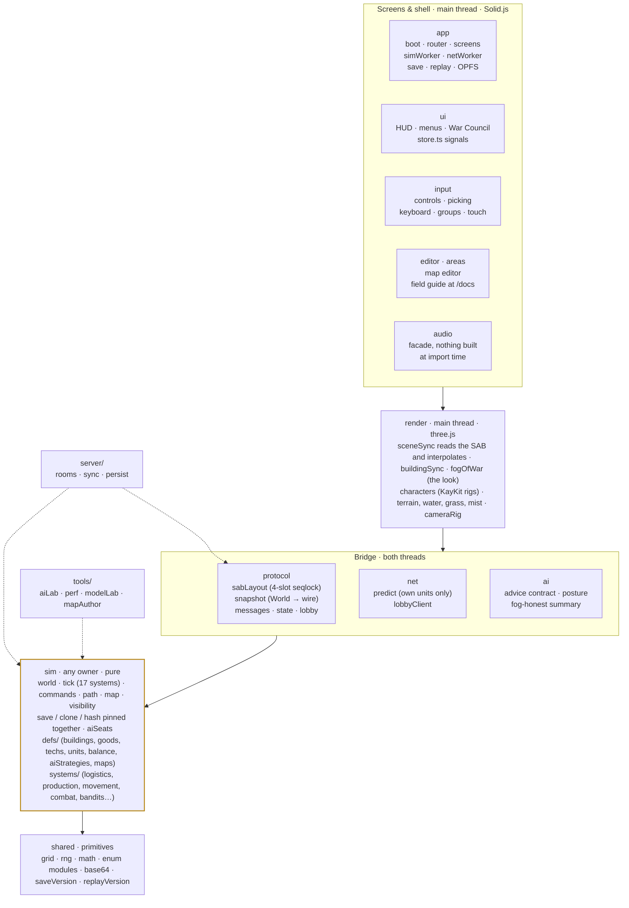
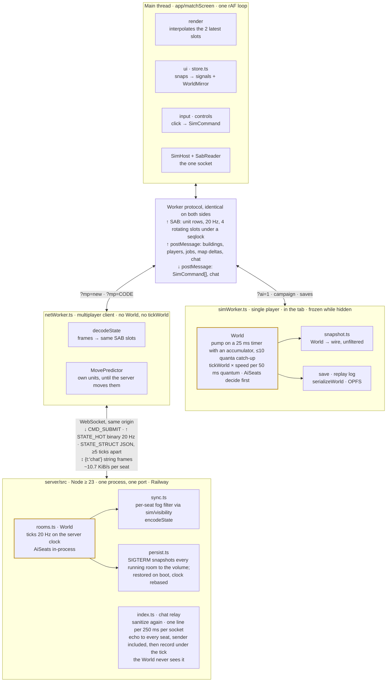

# Architecture: one pure world, two owners, one wire

> **Status: description, not plan.** This is the shape of the code as of
> v0.14 (September 2026), drawn in one piece. The `README.md` Architecture
> section and the file-header comments quoted here are the primary record;
> when they disagree with this page, the code wins and this page is stale.

Serf Valley is built on one idea: the simulation is a pure, deterministic
`World` that never touches the DOM, three.js, or a socket. Whoever owns the
World ticks it at 20 Hz and publishes what a seat may see. In single player
that owner is a Web Worker in the tab; in multiplayer it is a Node process on
Railway. The renderer, HUD and input layer above cannot tell which one they
are talking to.

| | |
| --- | --- |
| ~115k | TypeScript lines including tests |
| 20 Hz | tick and publish rate (`TICK_MS = 50`) |
| 17 | systems per tick, in a fixed order |
| 2 | owners of the World: `simWorker.ts`, `server/src/rooms.ts` |
| 1 | worker protocol both owners speak |

## The layers, and what may import what

The source tree is a strict stack. Every directory imports only from
directories drawn at or below it, and `src/sim` imports nothing but its own
`defs/` and `src/shared`. That is what lets Node load the sim straight from
source for the server and the labs, with no build step: those files spell
out `.ts` on their imports and carry no browser types.



Lines per directory, including tests: `sim` 44.9k, `render` 21.0k, `ui`
16.9k, `editor` + `areas` 8.7k, `input` 7.4k, `app` 6.4k, `audio` 2.6k,
`protocol` 2.5k, `shared` 2.3k, `ai` 2.0k, `net` 0.7k. The sim is the
heaviest layer and the only one with no dependency above `shared`. The one
cross-cut is the AI brain: `sim/systems/ai.ts` reads a World and emits
ordinary commands, and `src/ai` shapes the posture it plays.

Directory-level import edges, non-test files, from the code as it stands:

| From | Imports |
| --- | --- |
| `shared` | nothing |
| `sim` | shared |
| `ai` | sim, shared |
| `protocol` | sim, shared |
| `audio` | shared, render (1) |
| `render` | sim, shared, protocol, audio, input (types) |
| `input` | sim, ui, render, shared, app, protocol, audio |
| `net` | sim, protocol, ui, shared |
| `ui` | sim, shared, render, protocol, app, audio, input, editor, net |
| `app` | sim, render, protocol, ui, shared, audio, input, net |
| `areas` | sim, ui, shared, render, app |
| `editor` | sim, render, shared, input, app |
| `server` | sim, protocol, shared, app (`replay.ts` only) |
| `tools/aiLab` | sim, ai, shared |
| `tools/modelLab` | render, sim, shared, protocol |
| `tools/perf`, `tools/mapAuthor` | sim, shared |

`render` never imports `ui` or `app`. `ui`, `input` and `app` are the one
mutually referencing cluster, and most of those edges are `import type`.

## Two owners of the World, one socket on the main thread

The main thread never holds a `World`. It holds a `SabReader` over a
SharedArrayBuffer and a `SimHost` (`src/app/simHost.ts`) that speaks the
worker protocol in `src/protocol/messages.ts`. Two workers implement the far
end of that protocol. `simWorker.ts` owns a World, runs `tickWorld`, and
hosts the AI brains. `netWorker.ts` owns nothing but a WebSocket: it decodes
the server's frames into the same SAB slots and the same structural channel.
The renderer cannot tell them apart, which is why fog is enforced on the
server rather than drawn by the client.



A client is never given what it may not see. The solo worker publishes a
full snapshot because the only seat is the player's. The server publishes
through `sync.ts`: units by current visibility, buildings by exploration
frozen at last sight. The netWorker's one liberty is `net/predict.ts`, which
walks the player's own units along the path they were sent until the
server's frames take over, then decays the offset. Both owners run the same
`sim/` files; AI brains sit beside the World, never in a replica, and there
is no AI netcode.

Chat is the one thing on the wire that is not world state. A line typed at
the HUD (Enter opens it, networked matches only) goes down the worker
protocol as a `chat` message, out of `netWorker.ts` as a `{t:'chat'}` string
frame, and is relayed by `server/src/index.ts` to every connected seat,
sender included, so everyone reads the same lines in the same order. It
never enters a room's `World`: no command, no tick, no hash.
`src/protocol/chat.ts` is the trust boundary, a dependency-free sanitizer
(one line, control characters collapsed, at most 200 code points) that the
client runs before sending and the relay runs again regardless. The relay
drops a second line inside 250 ms silently rather than erroring, since an
error would cost the seat its socket. The solo worker drops chat on the
floor, and the same toast card carries the AI heralds' announcements.

A recording keeps what the table said. After echoing a line, the relay
records it under the room's current tick, and `ReplayData` carries that
`chat` log beside the commands, never among them, so `REPLAY_VERSION` and
the tick hash are untouched; on playback the solo worker walks the log with
its own cursor and posts each line at its tick through the same `chat`
worker message. The War Council has the same chat on the lobby socket
(`net/lobbyClient.ts`), served by the same relay handler; lobby lines happen
before tick 0 and are not recorded.

## Inside a tick

`sim/tick.ts` runs the systems in one fixed order every 50 ms of game time.
Commands from every seat arrive stamped with the seat that issued them and
are applied in canonical `(playerId, seq)` order, never arrival order, so the
same inputs always make the same world. AI brains think before the tick from
the same state everyone else sees; deciding afterwards would hand them a
frame of hindsight.

```
commands → research → production → logistics → construction → staffing →
training → hiring → wander → movement → separation → combat → waypoints →
bandits → trails → victory → removeDead
```

**In**

- Players' `SimCommand`s: build, move, hire, research, forge, repair, admin,
  in seat-then-sequence order.
- Brain commands from `AiSeats`, one brain per computer seat, each dealt a
  playbook from `defs/aiStrategies.ts`.
- The World's own `Rng` state. Player commands apply only on a quantum's
  first tick; the sim revalidates every one, so HUD gating is advisory.

**Out**

- `pendingDeltas` and `pendingEvents`: drain-once outboxes for map changes
  and alerts, emptied once per pump.
- A publish: `snapshot.ts` turns the World into unit rows for the SAB and
  structural snaps for postMessage.
- The replay log: every executed command, player and AI alike, per tick.
  `hash.ts` digests the World so `tools/perf` and the replay tests can prove
  a change left it bit-identical.

Order is content. Logistics runs before construction so a load delivered
this tick counts this tick; movement runs before separation so soldiers are
pushed apart from where they actually stepped; victory is judged before the
dead are removed.

## Directory guide

| Directory | Responsibility | Load-bearing files |
| --- | --- | --- |
| `src/sim` | The World and everything that changes it. Pure, deterministic, serializable; imports only `defs/` and `shared`. Content is data in `defs/`, never special-cased ids in systems. | `world.ts` · `tick.ts` · `commands.ts` · `path.ts` · `visibility.ts` · `save.ts` / `clone.ts` / `hash.ts` · `aiSeats.ts` · `systems/*` · `defs/*` |
| `src/render` | three.js scene fed only by SAB rows and structural snaps. Interpolates between publishes on its own rAF clock; dresses KayKit rigs at runtime; owns the look of fog, not the rule. | `renderer.ts` · `sceneSync.ts` · `buildingSync.ts` · `characters.ts` · `assets.ts` · `fogOfWar.ts` · `cameraRig.ts` |
| `src/ui` | Solid.js HUD, start menu, War Council lobby, tech tree, minimap, admin panel. Main-thread state lives in `store.ts` signals that worker updates write into. | `Hud.tsx` · `MenuApp.tsx` · `WarCouncil.tsx` · `store.ts` · `SelectionPanel.tsx` · `TechTreePanel.tsx` · `icons.tsx` |
| `src/input` | Pointer, keyboard and touch into commands and selection: band select, control groups, edge scroll, order modes, long-press move on touch. | `controls.ts` · `picking.ts` · `keyboard.ts` · `groups.ts` · `edgeScroll.ts` |
| `src/app` | Boot, the in-place router (Navigation API), per-screen chunks, the two workers and the `SimHost` seam, saves and replays in OPFS, service worker, GPU-loss recovery. | `main.ts` · `router.ts` · `matchScreen.ts` · `simHost.ts` · `simWorker.ts` · `netWorker.ts` · `saveStore.ts` · `replay.ts` |
| `src/editor` · `src/areas` | The map editor screen (brushes, symmetry, play-test) and the field guide at `/docs`, a wiki generated over the game's own defs with one shared WebGL preview context. | `editor/editorScreen.ts` · `editor/editorMap.ts` · `areas/docs/docsScreen.tsx` · `areas/docs/preview/hub.ts` |
| `src/protocol` | The shapes both owners speak: the SAB layout and its seqlock, World-to-wire snapshots, the worker message union, the binary state and command encoding, lobby config, the chat sanitizer. | `sabLayout.ts` · `snapshot.ts` · `messages.ts` · `state.ts` · `lobby.ts` · `chat.ts` |
| `src/net` | Client-side movement prediction for the player's own units across the round trip, and the lobby WebSocket client. | `predict.ts` · `lobbyClient.ts` |
| `src/ai` | What steers a brain: the whitelisted advice contract, the posture rule, and the fog-honest summary a seat is allowed to reason from. The LLM strategist that once sat here was retired after the bake-off; the seam stayed. | `advice.ts` · `posture.ts` · `summary.ts` · `archetype.ts` |
| `src/audio` | A facade of plain functions that constructs nothing at import time, so any layer can import it safely. | `audio.ts` · `settings.ts` |
| `src/shared` | Primitives with no opinions: tile grid maths, the seeded RNG, enum modules, base64, and the save and replay version constants. | `grid.ts` · `rng.ts` · `math.ts` · `enum.ts` · `saveVersion.ts` · `replayVersion.ts` |
| `server/src` | One Node process: static host with COOP/COEP, WebSocket relay (orders in, frames out, chat echoed around the table), rooms that own Worlds, per-seat filtering, snapshot-on-SIGTERM persistence, a smoke test that boots the sim from source. Loads `sim`, `protocol`, `shared` and `app/replay.ts` straight from `src/`. | `index.ts` · `rooms.ts` · `sync.ts` · `persist.ts` · `smoke.ts` |

## Rules the code keeps

- **The sim is pure and deterministic.** No DOM, no three.js, no sockets,
  no clocks, no `Math.random`, no approximated maths.
  `determinism.lint.test.ts` bans `Math.hypot`, `Date.now` and friends from
  every non-test sim file (worldgen in `map.ts` excepted); `clone.test.ts`
  pins save, clone and hash to each other. A new World field goes into
  `save.ts`, `clone.ts` and `hash.ts` together and must survive a
  `serializeWorld` round trip, because deploys restore live matches through
  it.
- **Content is data.** Buildings, goods, techs, units, difficulty, missions
  and AI playbooks live in `sim/defs/`. Systems read defs; they never test
  for a particular id. Goods order, unit kind codes and tile resource values
  are frozen because they are the wire format and part of the hash.
- **Visibility is a sim question; fog is a render answer.**
  `sim/visibility.ts` decides whether a tile is observed so the server can
  decide what to send. `render/fogOfWar.ts` only decides how the frontier
  looks.
- **The AI is a player, not a system.** One brain per seat, called beside
  whichever host owns the World, emitting the same commands a human does. No
  replica worlds, no AI netcode, and thinking never blocks a tick.
- **The main thread never simulates.** It reads a SharedArrayBuffer under a
  seqlock and reacts to structural messages. Cross-origin isolation is
  required at boot and fails loudly if missing.
- **Only world state goes through the World.** Chat rides the socket as its
  own frame and is relayed, never ticked, so the tick hash stays a record of
  the match alone; a recording keeps the lines beside the commands, never
  among them. Anything a seat sends that is not a command is sanitized at
  both ends, and the server's copy of the sanitizer is the one that counts.
- **Node runs the sim from source.** Files the server and labs load spell
  `.ts` on their imports; Node ≥ 23 strips the types. `pnpm smoke` guards the
  arrangement; `pnpm typecheck` compiles the root, the server and each lab.

## Satellites around the sim

- **`tools/aiLab`** — the bake-off: headless AI-vs-AI matches with error
  bars. Judges every brain change through the advice seam. Bakeoff, balance,
  tiers, compare, evolve.
- **`tools/perf`** — behaviour-preservation digest (world hash every N
  ticks), a per-system profiler, and a late-game stress valley to see where
  the tick budget goes.
- **`tools/mapAuthor`** — landforms, not seeds: the vocabulary the seven
  mission recipes are written in, exported to checked-in files under
  `sim/defs/maps/`.
- **`tools/modelLab`** — a sketchpad for building compositions before they
  earn a place in `render/assets.ts`; KayKit models and props framed as the
  game frames them.
- **`src/editor`** — the in-game map editor: brushes, symmetry, naturalize,
  a play-area overlay and a play-test that boots a real World from the
  painted map.
- **`src/areas/docs`** — the field guide at `/docs`, a wiki rendered from
  the same defs the sim runs on, with live 3D previews in one shared WebGL
  context.

The other files in this directory are feature plans, each marked with its
status at the top: AI robustness, the campaign tutorial, the research tree
and brewery, the tools economy.
